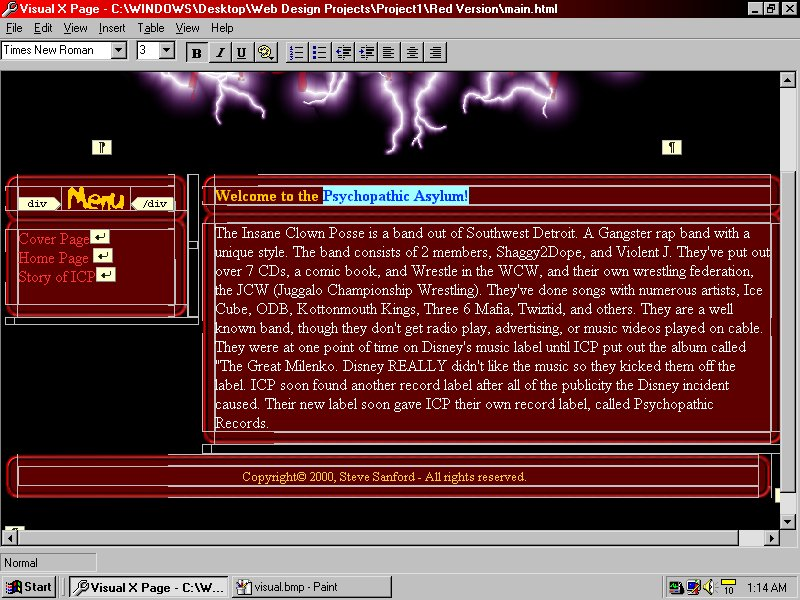



## TRUE WYSIWYG/Visual HTML Editing

### Description

This is a real example of how to use FrontPage style visual editing of HTML. Features drag and drop support for CSS, and

HTML 4.0. After searching the net for info on creating HTML editing tools with visual basic I've finally found out how to do

it. I've posted the source code to an open source HTML editor I've been working on for some time. Please send any updates of

this code to me at ssanford@neo.rr.com. And give credit where its deserved.

NOTE: Its VERY important that you read the readme.txt before trying to open this code!

Also check out my site for the newest source code for Visual X Page. http://nms.telefragged.com.
 
### More Info
 

             |
---                |---
**Submitted On**   |2000-12-13 19:19:34
**By**             |[Steve Sanford](https://github.com/Planet-Source-Code/PSCIndex/blob/master/ByAuthor/steve-sanford.md)
**Level**          |Intermediate
**User Rating**    |4.4 (40 globes from 9 users)
**Compatibility**  |VB 6\.0
**Category**       |[Internet/ HTML](https://github.com/Planet-Source-Code/PSCIndex/blob/master/ByCategory/internet-html__1-34.md)
**World**          |[Visual Basic](https://github.com/Planet-Source-Code/PSCIndex/blob/master/ByWorld/visual-basic.md)
**Archive File**   |[CODE\_UPLOAD1288812202000\.zip](https://github.com/Planet-Source-Code/steve-sanford-true-wysiwyg-visual-html-editing__1-13747/archive/master.zip)

